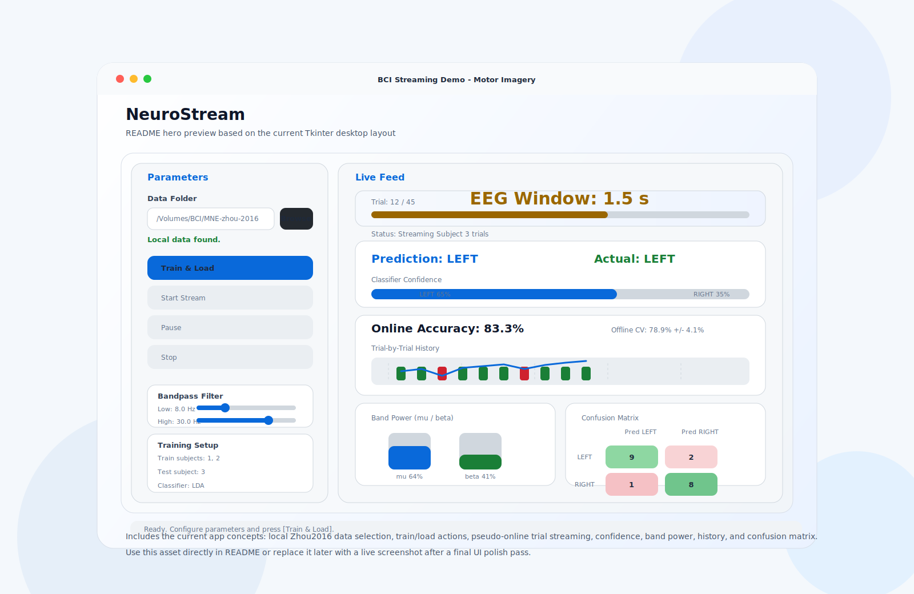

# NeuroStream

**Real-time BCI motor imagery streaming demo for macOS.**



NeuroStream trains a cross-subject EEG motor imagery classifier on the [Zhou2016](https://doi.org/10.1371/journal.pone.0162657) dataset via [MOABB](https://moabb.neurotechx.com), then replays a held-out subject as a pseudo-online stream. All feature extraction and classification pipelines are directly sourced from MOABB and pyriemann.

## Highlights

- **Four selectable pipelines** via MOABB / pyriemann: CSP, FBCSP, TS+LDA, TS+SVM
- **Euclidean Alignment (EA)** for cross-subject covariance shift reduction (CSP and FBCSP)
- **Riemannian geometry** (pyriemann): covariance estimation → Tangent Space classifier
- Desktop UI built with `tkinter`, background training thread, `root.after()` driven streaming
- Uses an existing local `MNE-zhou-2016/` folder when available — no forced redownload
- All parameters exposed in the UI and stored in `BCIConfig`

## What The App Shows

| Area | Purpose |
| --- | --- |
| Data Folder | Point the app at a local Zhou2016 download |
| Feature Extraction | Choose CSP / FBCSP / TS (Riemannian) |
| Classifier | Choose LDA / SVM |
| Spatial Filters | Set CSP filter count; set custom frequency bands for FBCSP |
| Train & Load | Build and fit the model without freezing the GUI |
| Live Feed | Pseudo-online trial countdown and prediction state |
| Confidence Bar | LEFT vs RIGHT class probability |
| Band Power | Relative mu and beta power for the current trial |
| Trial History | Recent hits / misses and cumulative accuracy line |
| Confusion Matrix | Running class-level performance (LEFT vs RIGHT) |

## Pipelines

All pipelines are implemented using MOABB and pyriemann building blocks.

### CSP

```text
Raw EEG
  -> Bandpass filter (configurable, default 8–30 Hz)
  -> Euclidean Alignment (He & Wu 2020)
  -> mne.decoding.CSP  (log-variance features)
  -> LDA or linear SVM
```

Classic MOABB baseline — Jayaram & Barachant (2018).

### FBCSP

```text
Raw EEG
  -> moabb.paradigms.FilterBankLeftRightImagery
     (configurable bands, default: 8–12, 12–16, 16–20, 20–24, 24–28, 28–32 Hz)
  -> Euclidean Alignment per band
  -> moabb.pipelines.utils.FilterBank(CSP)  — CSP applied per band, features concatenated
  -> LDA or linear SVM
```

Ang et al. (2012).

### TS+LDA / TS+SVM

```text
Raw EEG
  -> Bandpass filter
  -> pyriemann.estimation.Covariances (OAS estimator)
  -> pyriemann.tangentspace.TangentSpace (Riemannian metric)
  -> LDA or linear SVM
```

Barachant et al. (2013). Top-performing family in MOABB motor imagery benchmarks.

## Quick Start

### Requirements

- Python 3.9+
- macOS with `tkinter` available

```bash
pip install -r requirements.txt
```

### Dataset Layout

```text
/your/data/path/
└── MNE-zhou-2016/
    ├── sub-1/
    ├── sub-2/
    ├── sub-3/
    └── sub-4/
```

If not present, MOABB can download it automatically on first run.

### Run

```bash
python main.py
```

### Typical Workflow

1. Paste or browse to the folder containing `MNE-zhou-2016/`.
2. Select **Feature Extraction** method and **Classifier**.
3. Adjust Bandpass / Epoch Window / Spatial Filters as needed.
4. Click **Train & Load**.
5. Click **Start Stream** to replay the held-out subject trial by trial.
6. Use **Pause** / **Stop** while inspecting live metrics.

## Project Structure

```text
APP/
├── main.py            Entry point (window init + mainloop)
├── config.py          BCIConfig dataclass — all tunable parameters
├── data_engine.py     MOABB data loading, paradigm selection, EA alignment
├── model.py           Pipeline factory (CSP / FBCSP / TS+LDA / TS+SVM)
├── streaming.py       Trial-by-trial streaming simulator
├── ui/
│   ├── app_view.py    Tkinter layout, state machine, training/streaming control
│   └── plots.py       Canvas drawing functions (confidence, band power, confusion matrix, chart)
└── requirements.txt
```

## Default Parameters

| Parameter | Default |
| --- | --- |
| Feature Extraction | `CSP` |
| Classifier | `LDA` |
| Bandpass | `8.0 – 30.0 Hz` |
| Epoch Window | `0.0 – 3.0 s` |
| CSP Filters | `8` |
| FBCSP Bands | `8-12, 12-16, 16-20, 20-24, 24-28, 28-32 Hz` |
| Train Subjects | `1, 2` |
| Test Subject | `3` |

## References

- **Zhou2016 dataset**: Zhou et al. (2016). *A Fully Automated Trial Selection Method for Optimization of Motor Imagery Based BCI.* PLOS ONE.
- **MOABB**: Jayaram & Barachant (2018). *MOABB: trustworthy algorithm benchmarking for BCIs.* J. Neural Eng.
- **Euclidean Alignment**: He & Wu (2020). *Transfer learning for BCIs: A Euclidean space data alignment approach.* IEEE Trans. Biomed. Eng.
- **FBCSP**: Ang et al. (2012). *Filter bank common spatial pattern algorithm on BCI competition IV.* Front. Hum. Neurosci.
- **Tangent Space / Riemannian geometry**: Barachant et al. (2013). *Classification of covariance matrices using a Riemannian-based kernel.* Signal Processing.
- **CSP**: Blankertz et al. (2008). *Optimizing spatial filters for robust EEG single-trial analysis.* IEEE Signal Process. Mag.

## License

MIT. See [LICENSE](LICENSE).
